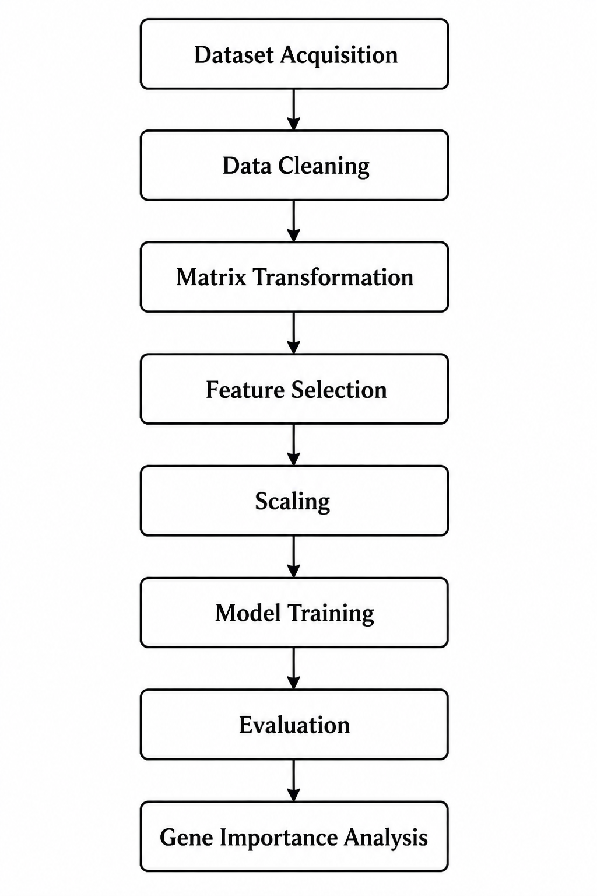

<div align="center">

### 🧬 Gene Expression-Based Leukemia Classification Using Feature Selection and Machine Learning

<p>
  
</p>
<p>
  
  
  
  
</p>
<p>
  
</p>
</div>


<div align="center">

</div>
<div align="center">
<table>
<tr>
<td align="center" width="25%">

### 🧬 Dataset

Golub Leukemia Dataset
Microarray Gene Expression

</td>
<td align="center" width="25%">

### ⚙️ Models

LR · SVM · RF · KNN

</td>
<td align="center" width="25%">

### 📊 Features

7129 Genes → Top 100

</td>
<td align="center" width="25%">

### 🧠 Domain

Biomedical AI

</td>
</tr>
</table>
</div>


<div align="center">
<table>
<tr>
<td width="50%">

### 🔬 Focus

* High-dimensional gene expression analysis
* Leukemia subtype classification
* Feature selection for dimensionality reduction
* Biomedical interpretability
* Cross-validation evaluation

</td>
<td width="50%">

### 🚀 Project Highlights

* Biomedical ML Pipeline
* Explainable Feature Importance
* Multi-model comparison
* Publication-oriented workflow

</td>
</tr>
</table>
</div>


<table>
<tr>
<td width="60%">
<p align="center">
  
  
  
  
</p>


## 📌 Project Overview

This project presents a machine learning framework for leukemia subtype classification using high-dimensional gene expression data. The objective is to distinguish between Acute Lymphoblastic Leukemia (ALL) and Acute Myeloid Leukemia (AML) using feature selection and multiple classification algorithms.

### The framework integrates:

* Gene expression preprocessing
* Feature selection using ANOVA F-score
* Model comparison
* Cross-validation
* Gene importance interpretation

The study is based on the Golub Leukemia Dataset, a benchmark dataset widely used in biomedical machine learning research.


## 🧪 Dataset Information

### 📂 Dataset Used here:

Golub Leukemia Gene Expression Dataset (1999) - Kaggle

The dataset contains thousands of gene expression measurements collected from leukemia patients.


### Dataset Summary

* Feature	Details

* Disease Type	Leukemia

* Classes	ALL / AML

* Total Samples	~72

* Gene Features	7129

* Data Type	Microarray Gene Expression


## 🧠 Machine Learning Workflow

<p align="center">
  
</p>


## 🧩 Project Structure

```text
Gene-Expression-Based-Leukemia-Classification/
├── dataset_info/
├── notebooks.ipynb
├── src/
├── results/
├── README.md
├── requirements.txt
├── .gitignore
└── LICENSE
```


## ⚙️ Models Evaluated

### The following machine learning models were compared:

* Logistic Regression	Linear probabilistic classifier

* Support Vector Machine	Margin-based classifier

* Random Forest	Tree ensemble model

* K-Nearest Neighbors	Distance-based classifier


## 📊 Model Performance

| Model                    |  Accuracy | Precision  | Recall | F1-Score  | ROC-AUC |
|--------------------------|-----------|------------|--------|-----------|---------|
| Random Forest            | 0.7333    | 0.6667     | 0.4000 | 0.5000    | 0.7000  |
| Support Vector Machine   | 0.7333    | 0.6000     | 0.6000 | 0.6000    | 0.8800  |
| Logistic Regression      | 0.8333    | 1.0000     | 0.8000 | 0.8889    | 0.9400  |
| K-Nearest Neighbors      | 0.7333    | 0.6667     | 0.4000 | 0.5000    | 0.7900  |


## 📈 Experimental Outputs

### This project generates:-

* ROC Curve Comparison
* Confusion Matrix
* Top 20 Gene Importance Plot
* Cross Validation Accuracy Plot

<p align="center">
  
</p>
<p align="center">
  
</p>
<p align="center">
  
</p>
<p align="center">
  
</p>


## 🚀 Installation

### Clone the Repository

```bash
git clone https://github.com/your-username/Gene-Expression-Based-Leukemia-Classification.git
```

### Move to Project Directory

```bash
cd Gene-Expression-Based-Leukemia-Classification
```

### Install Dependencies

```bash
pip install -r requirements.txt
```


### ✨ Key Features

* High-dimensional gene expression analysis
* Feature selection using SelectKBest
* Multiple ML model comparison
* Biomedical interpretability
* Cross-validation based evaluation


---

---

## 👨‍💻 Author

<div align="center">


<br><br>

<table>
<tr>
<td align="center" width="500">

### 🧑‍🎓 Sahil Kumar  
**Robotics & Artificial Intelligence Student**  
Sir M. Visvesvaraya Institute of Technology  
Bengaluru, India  

</td>
</tr>
</table>

<br>

<p align="center">
  <a href="https://github.com/sahil07-rg">
    
  </a>
  
  <a href="https://www.linkedin.com/in/sahil-kumar-21a7aa316/">
    
  </a>
</p>

</div>


### ⭐ Support

If you found this project useful, consider starring the repository.


### 📜 License

This project is intended for academic and research purposes.
